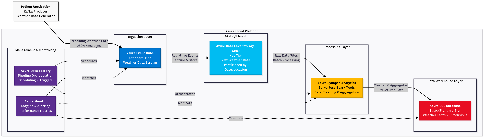

# 🌾 AgriIntel – A Weather-Aware Farming Assistant

**AgriIntel** is a personal, learning-driven project that combines real-time data streaming, batch processing, analytics, and GenAI to build a smart assistant for farmers.

The goal is to simulate and process environmental sensor data (like temperature, humidity, and rainfall) to deliver **location-specific farming insights**. Think of it as a platform that helps answer questions like:

* *“Do I need to water my crops today?”*
* *“Is this month drier than average?”*
* *“How should I manage fungal risk for my wheat crop in Lucknow?”*


---
### Data Architecture (expected)


---

## 🚀 Local Development Setup

Follow these steps to get the project running on your local machine.

### 1. Start Core Infrastructure

The Kafka message broker runs in Docker. Start it first:

```bash
docker-compose up -d
```

### 2. Install Python Dependencies

It is highly recommended to use a Python virtual environment.

```bash
# For the data simulator
pip install -r simulator/requirements.txt

# For the data consumer/writer
pip install -r file_writer/requirements.txt
```

### 3. Configure Spark Environment

The project uses Apache Spark for data processing.

**Prerequisites:**
*   **Java 8 or 11:** Spark runs on the JVM. Ensure you have a compatible JDK installed.
*   **Python 3.8+**

**Installation:**
Install `pyspark` in your virtual environment. We'll use version `3.4.1` to match our Kafka connector.

```bash
pip install pyspark==3.4.1
```

This setup uses the `spark-sql-kafka` package, which is automatically downloaded by Spark thanks to the configuration within the verification script. No manual dependency management or environment variables are needed for this step.
---

## 💡 Key Features

* **Kafka-based Simulation**
  Simulate weather sensor data using a Kafka producer to mimic real-time data ingestion.

* **Kafka Streaming Pipeline**
  A Kafka consumer captures these events and stores them as structured files (JSON/Parquet).

* **Raw Data Lake**
  Data is stored in a timestamp-organized directory structure for easy batch access and replay.

* **Apache Spark for Batch Processing**
  Periodically transforms and aggregates the raw data (e.g., daily averages, rainfall totals).

* **PostgreSQL as a Serving Layer**
  Cleaned, aggregated results are stored in a relational database for querying.

* **Streamlit Dashboard & LLM Assistant**
  Visualize trends, compare regions, and chat with a FastAPI-based LLM assistant trained on farming rules and weather data.

---

## 📂 Expected Folder Structure

```
agriintel/
├── simulator/                  # Sensor simulator (Kafka producer)
│   ├── producer.py
│   └── config.py
│
├── consumer/                   # Kafka consumer → raw file writer
│   ├── consumer.py
│   └── storage_writer.py
│
├── data/
│   ├── raw/                    # Raw Kafka output (JSON/Parquet)
│   └── processed/              # Spark-aggregated results
│
├── spark_jobs/                 # Spark batch transformation logic
│   ├── aggregate_weather.py
│   └── job_config.yaml
│
├── database/                   # PostgreSQL schema and diagrams
│   ├── init.sql
│   └── schema_diagram.png
│
├── analytics/                  # Dashboards and notebooks
│   ├── streamlit_app.py
│   └── notebook.ipynb
│
├── llm_assistant/              # FastAPI + OpenAI assistant
│   ├── app.py
│   └── prompts/
│
└── utils/                      # Shared helper functions
    ├── logger.py
    └── config_loader.py
```

---

## 📊 High-Level Data Flow

```
[Data Simulator]
      ↓
[Kafka Producer → Kafka Topic]
      ↓
[Kafka Consumer → File Storage]
      ↓
[Apache Spark Batch Jobs]
      ↓
[PostgreSQL Database]
      ↓
[Streamlit Dashboard & LLM Assistant]
```

---

## 🛠️ Tools Involved

| Component     | Tech Used                |
|---------------|--------------------------|
| Simulation    | Kafka Producer (Python)  |
| Ingestion     | Kafka Consumer           |
| Storage (Raw) | Local File System        |
| Processing    | Apache Spark (PySpark)   |
| Final Storage | PostgreSQL               |
| Analytics     | Streamlit                |
| LLM Assistant | FastAPI + OpenAI API     |

---